##  {background-color="#2c3e50"}
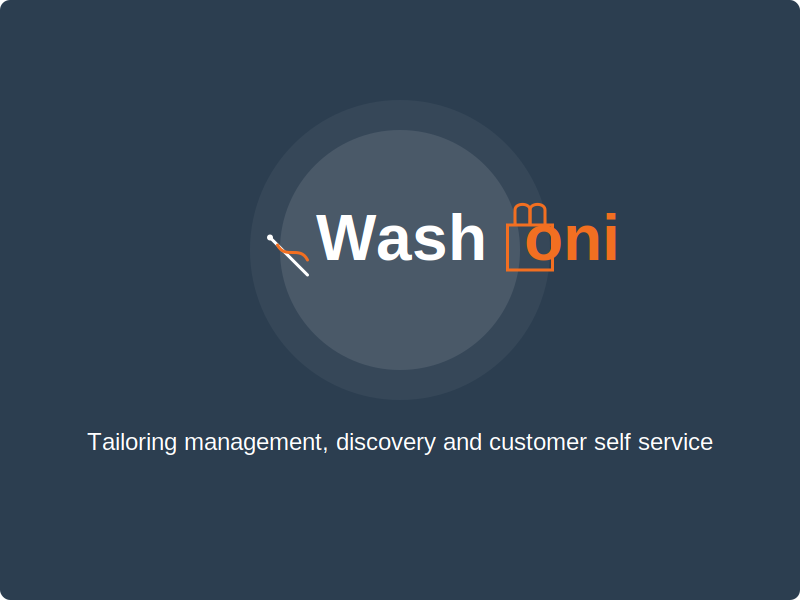{style="display: block; margin-left: auto; margin-right: auto;"}

##  {background-color="#f8f9fa"}

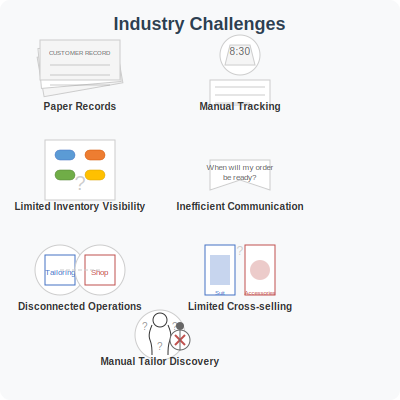{style="display: block; margin-left: auto; margin-right: auto;"}

##  {background-color="#f8f9fa"}

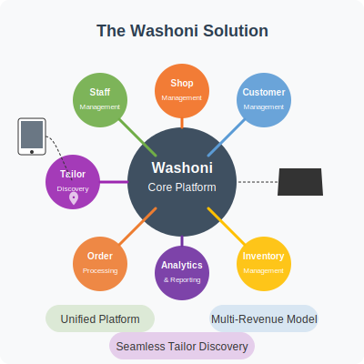{style="display: block; margin-left: auto; margin-right: auto;"}

##  {background-color="#f8f9fa"}

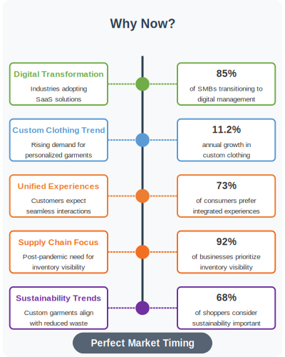{style="display: block; margin-left: auto; margin-right: auto;"}

## Market Opportunity {background-color="#f8f9fa"}

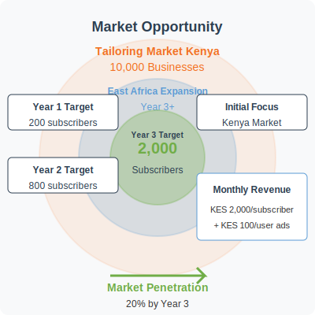{style="display: block; margin-left: auto; margin-right: auto;"}

##  {background-color="#f8f9fa"}
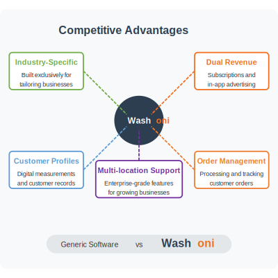{style="display: block; margin-left: auto; margin-right: auto;"}

## {background-color="#f8f9fa"}

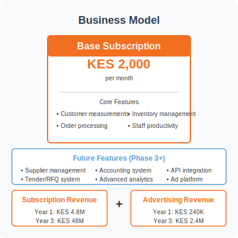{style="display: block; margin-left: auto; margin-right: auto;"}

## {background-color="#f8f9fa"}
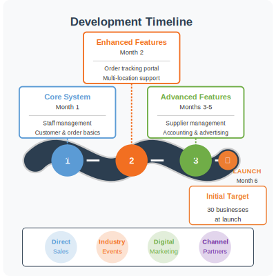{style="display: block; margin-left: auto; margin-right: auto;"}

##  {background-color="#f8f9fa"}
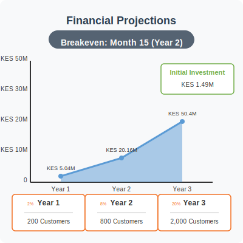{style="display: block; margin-left: auto; margin-right: auto;"}

##  {background-color="#f8f9fa"}
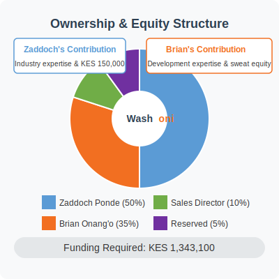{style="display: block; margin-left: auto; margin-right: auto;"}

##  {background-color="#2c3e50"}

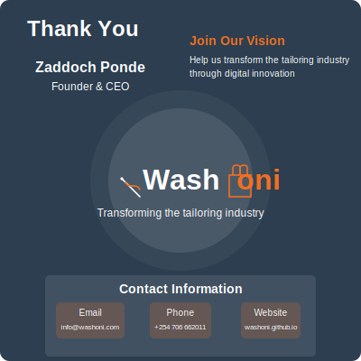{style="display: block; margin-left: auto; margin-right: auto;"}
